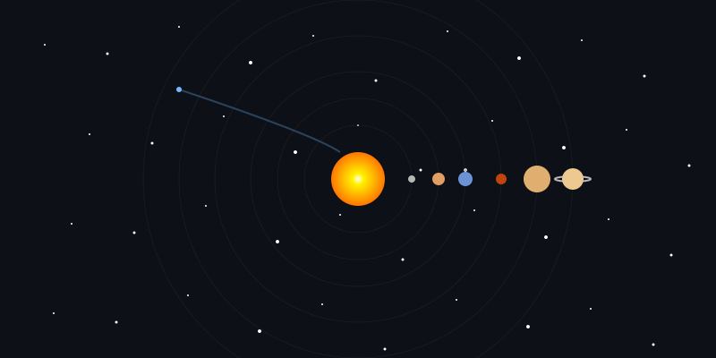

<h1 align="center">
  
</h1>

<!-- 3D Universe Floating Animation using SVG -->
<div align="center">
  <picture>
    <source media="(prefers-color-scheme: dark)" srcset="https://raw.githubusercontent.com/platane/platane/output/github-contribution-grid-snake-dark.svg">
    <source media="(prefers-color-scheme: light)" srcset="https://raw.githubusercontent.com/platane/platane/output/github-contribution-grid-snake.svg">
    
  </picture>
</div>

<br>

<!-- Animated Section Title -->
<div align="center">
  
  <h2>🚀 About Me</h2>
  
</div>


<div align="center">
  <a href="https://git.io/typing-svg"></a>
</div>

<!-- 3D-style Tech Stack with CSS Animation -->
<div align="center">
  <table>
    <tr>
      <td>
        <div align="center">
          <pre>
<span style="color: #00FFFF;">/**
 * AstronDaniel.js
 */</span>

<span style="color: #F7DF1E;">class</span> <span style="color: #00BFFF;">Developer</span> {
  <span style="color: #F7DF1E;">constructor</span>() {
    <span style="color: #00BFFF;">this</span>.name = <span style="color: #00FF00;">"Daniel"</span>;
    <span style="color: #00BFFF;">this</span>.role = <span style="color: #00FF00;">"Astronomer & Full Stack Developer"</span>;
    <span style="color: #00BFFF;">this</span>.languages = [<span style="color: #00FF00;">"JavaScript"</span>, <span style="color: #00FF00;">"Python"</span>, <span style="color: #00FF00;">"TypeScript"</span>, <span style="color: #00FF00;">"HTML/CSS"</span>];
    <span style="color: #00BFFF;">this</span>.frameworks = [<span style="color: #00FF00;">"React"</span>, <span style="color: #00FF00;">"Node.js"</span>, <span style="color: #00FF00;">"Express"</span>, <span style="color: #00FF00;">"TensorFlow"</span>];
    <span style="color: #00BFFF;">this</span>.databases = [<span style="color: #00FF00;">"MongoDB"</span>, <span style="color: #00FF00;">"MySQL"</span>, <span style="color: #00FF00;">"Firebase"</span>];
    <span style="color: #00BFFF;">this</span>.focus = <span style="color: #00FF00;">"Connecting Astronomy & Technology"</span>;
  }

  <span style="color: #F7DF1E;">sayHello</span>() {
    <span style="color: #FF00FF;">console</span>.log(<span style="color: #00FF00;">"Thanks for visiting my GitHub! Let's explore the cosmos through code."</span>);
  }
}

<span style="color: #F7DF1E;">const</span> me = <span style="color: #F7DF1E;">new</span> <span style="color: #00BFFF;">Developer</span>();
me.sayHello();
          </pre>
        </div>
      </td>
    </tr>
  </table>
</div>

<!-- Profile Views Counter with Animated Universe Background -->
<!-- <p align="center">
  
</p> -->
<p align="center">
  
</p>

<!-- Animated Section Separator -->
<div align="center">
  
  <h2>⚡ GitHub Stats</h2>
  
</div>

<!-- 3D-Looking Stats Cards with Glowing Effect -->
<div align="center">
  <a href="https://git.io/streak-stats">
    
  </a>
</div>

<br>

<div align="center">
  <a href="https://github.com/anuraghazra/github-readme-stats">
    
  </a>
  <a href="https://github.com/anuraghazra/github-readme-stats">
    
  </a>
</div>

<!-- 3D Activity Graph with Space Theme -->
<div align="center">
  <a href="https://github.com/Ashutosh00710/github-readme-activity-graph">
    
  </a>
</div>

<!-- GitHub Trophies Section -->
<div align="center">
  
  <h2>🏆 GitHub Trophies</h2>
  
</div>

<p align="center">
  <a href="https://github.com/ryo-ma/github-profile-trophy">
    
  </a>
</p>

<!-- Animated Skills Section with Glow Effect -->
<div align="center">
  
  <h2>🛠️ Tech Universe</h2>
  
</div>

<!-- Animated Tech Icons with Glow Effect -->
<div align="center">
  <table border="0">
    <tr>
      <td align="center" width="96">
        <a href="#">
          
        </a>
        <br>JavaScript
      </td>
      <td align="center" width="96">
        <a href="#">
          
        </a>
        <br>Python
      </td>
      <td align="center" width="96">
        <a href="#">
          
        </a>
        <br>React
      </td>
      <td align="center" width="96">
        <a href="#">
          
        </a>
        <br>Node.js
      </td>
      <td align="center" width="96">
        <a href="#">
          
        </a>
        <br>TypeScript
      </td>
      <td align="center" width="96">
        <a href="#">
          
        </a>
        <br>AWS
      </td>
    </tr>
    <tr>
      <td align="center" width="96">
        <a href="#">
          
        </a>
        <br>GitHub
      </td>
      <td align="center" width="96">
        <a href="#">
          
        </a>
        <br>Java
      </td>
      <td align="center" width="96">
        <a href="#">
          
        </a>
        <br>MySQL
      </td>
      <td align="center" width="96">
        <a href="#">
          
        </a>
        <br>Django
      </td>
      <td align="center" width="96">
        <a href="#">
          
        </a>
        <br>Webpack
      </td>
      <td align="center" width="96">
        <a href="#">
          
        </a>
        <br>C++
      </td>
    </tr>
  </table>
</div>

<!-- Cosmic Quote Section -->
<div align="center">
  
  <h2>💫 Cosmic Quote</h2>
  
</div>

<p align="center">
  
</p>

<!-- 3D Projects Showcase with Cards -->
<div align="center">
  
  <h2>🌌 Stellar Projects</h2>
  
</div>

<p align="center">
  <a href="https://github.com/AstronDaniel/Music-cloud">
    
  </a>
  <a href="https://github.com/AstronDaniel/GF_Food_grammer">
    
  </a>
   <a href="https://github.com/AstronDaniel/crop_diagnosis">
     
  </a>
  <a href="https://github.com/AstronDaniel/audio_effects_processor">
    
  </a>
</p> 

<p align="center">
  <a href="https://github.com/AstronDaniel?tab=repositories">
    
  </a>
</p>

<!-- Spotify Now Playing -->
<div align="center">
  
  <h2>🎵 Cosmic Soundwaves</h2>
  
</div>

<!-- Spotify -->
<div align="center">
  <a href="https://open.spotify.com/">
    
  </a>
</div>

<!-- Coding Stats -->
<div align="center">
  
  <h2>⏱️ Coding Time Continuum</h2>
  
</div>

<!--START_SECTION:waka-->


📊 **This Week I Spent My Time On** 

```text
💬 Programming Languages: 
Markdown                 2 hrs 1 min         ████████████████████░░░░░   78.72 % 
JavaScript               22 mins             ████░░░░░░░░░░░░░░░░░░░░░   14.38 % 
YAML                     7 mins              █░░░░░░░░░░░░░░░░░░░░░░░░   04.69 % 
Git Config               3 mins              ░░░░░░░░░░░░░░░░░░░░░░░░░   02.00 % 
Image (svg)              0 secs              ░░░░░░░░░░░░░░░░░░░░░░░░░   00.21 % 

🔥 Editors: 
VS Code                  2 hrs 34 mins       █████████████████████████   100.00 % 

💻 Operating System: 
Windows                  2 hrs 34 mins       █████████████████████████   100.00 % 
```

**I Mostly Code in JavaScript** 

```text
JavaScript               11 repos            ███████████░░░░░░░░░░░░░░   45.83 % 
HTML                     6 repos             ██████░░░░░░░░░░░░░░░░░░░   25.00 % 
PHP                      2 repos             ██░░░░░░░░░░░░░░░░░░░░░░░   08.33 % 
CSS                      2 repos             ██░░░░░░░░░░░░░░░░░░░░░░░   08.33 % 
Python                   1 repo              █░░░░░░░░░░░░░░░░░░░░░░░░   04.17 % 
```


 Last Updated on 02/03/2025 01:04:54 UTC
<!--END_SECTION:waka-->

<div align="center">
  

  
</div>

<!-- Skill Progress Bars -->
<div align="center">
  
  <h2>🚀 Skill Trajectories</h2>
  
</div>

<div align="center">
  
  
  
  
  
  
  
  
</div>

<!-- Current Learning Goals -->
<div align="center">
  
  <h2>🌌 Exploring New Galaxies</h2>
  
</div>

<div align="center">
  <table>
    <tr>
      <td align="center">
        
      </td>
      <td align="center">
        
      </td>
      <td align="center">
        
      </td>
    </tr>
  </table>
</div>

<!-- Global Visitor Map -->
<div align="center">
  
  <h2>🌎 Stellar Visitor Map</h2>
  
</div>

<!-- Updated visitor counter with cosmic styling -->
<p align="center">
  
</p>

<div align="center">
  
  
</div>

<!-- Contribution Graph 3D -->
<div align="center">
  
  <h2>🌠 Contribution Constellation</h2>
  
</div>

<!-- Snake animation -->
<div align="center">
  <a href="https://github.com/AstronDaniel">
    
  </a>
</div>

<!-- 3D Contribution Calendar -->
<div align="center">
  <a href="https://skyline.github.com/AstronDaniel/2023" target="_blank">
    
  </a>
</div>

<!-- 3D Contribution Stats Card -->
<div align="center">
  <a href="https://github.com/AstronDaniel?tab=repositories">
    
  </a>
</div>

<!-- Animated Spacer -->
<div align="center">
  
  <h2>🌠 Connect Across the Cosmos</h2>
  
</div>

<!-- 3D Social Media Buttons with Hover Effects -->
<div align="center">
  <a href="https://my-portfolio-liard-omega-20.vercel.app/" target="_blank">
    
  </a>
  <a href="https://x.com/astrav_d152" target="_blank">
    
  </a>
  <a href="https://www.linkedin.com/in/sempaladaniel/" target="_blank">
    
  </a>
  <a href="mailto:danielsempala6@gmail.com" target="_blank">
    
  </a>
</div>
 
<br>

<!-- Animated Footer with 3D effect -->


<!-- Hidden SVG for 3D Animation -->
<svg xmlns="http://www.w3.org/2000/svg" version="1.1" xmlns:xlink="http://www.w3.org/1999/xlink" xmlns:svgjs="http://svgjs.com/svgjs" width="1000" height="100" style="display:none;">
  <defs>
    <linearGradient x1="50%" y1="0%" x2="50%" y2="100%" id="sssquiggly-grad">
      <stop stop-color="hsl(217, 88%, 66%)" stop-opacity="0" offset="0%"></stop>
      <stop stop-color="hsl(217, 88%, 66%)" offset="100%"></stop>
    </linearGradient>
  </defs>
</svg>

<!-- GitHub Matrix SVG Animation -->


 